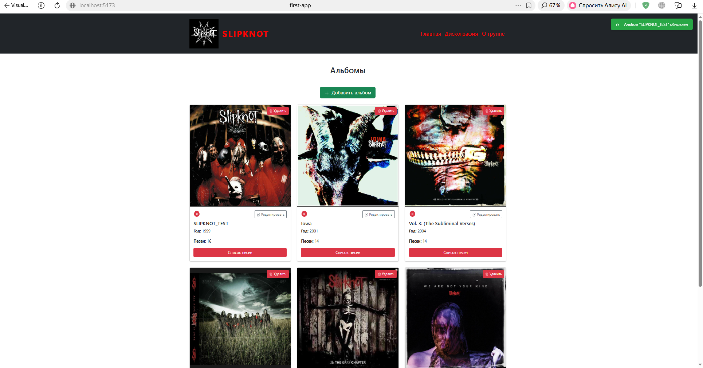
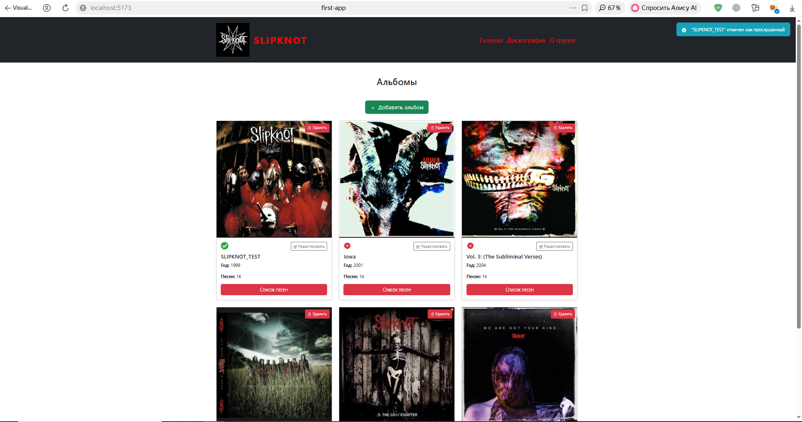
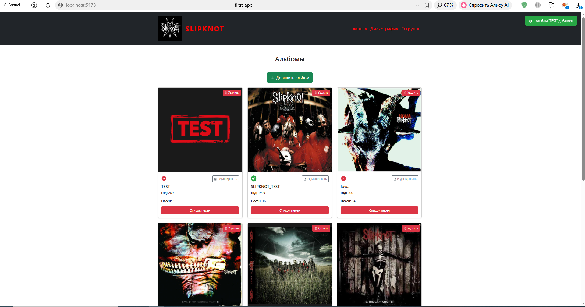
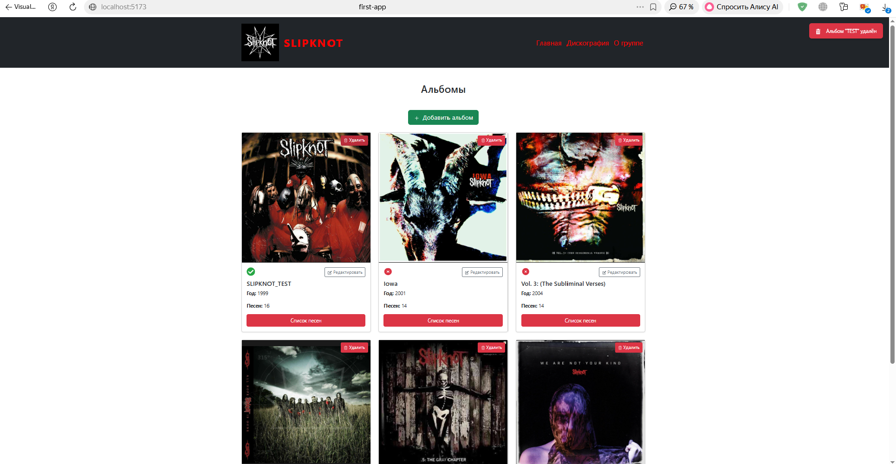

# Slipknot Discography 

## Скриншоты

 

 

 

 

React-приложение с информацией о музыкальных альбомах группы **Slipknot**.  
Позволяет просматривать дискографию, добавлять новые альбомы, удалять их, редактировать существующие, отмечать прослушанные и получать всплывающие уведомления о всех действиях.

## О проекте

Приложение отображает дискографию легендарной метал-группы Slipknot.  
Каждый альбом представлен в виде карточки с обложкой, годом выпуска и количеством песен.  
При клике на кнопку **«Список песен»** открывается модальное окно со списком всех треков альбома.

**Дополнительные возможности:**
- Добавление новых альбомов через форму (название, год, список песен через запятую).
- Редактирование данных любого альбома (кнопка «Редактировать» в карточке).
- Удаление альбомов (кнопка с иконкой корзины).
- Отметка статуса «Прослушано / Не прослушано» (кликабельные иконки галочка/крестик).
- Всплывающие уведомления с иконками при добавлении, удалении, редактировании и изменении статуса.
- Тестовое изображение для новых альбомов.

## Выполненные требования задания

- **Информация хранится в массиве** — в `AlbumCollection.jsx` определён массив `albums` с данными о каждом альбоме.
- **Вывод в виде списка** — используется `map()` для рендеринга массива в JSX.
- **Элементы списка — отдельный компонент** — `AlbumCard.jsx` отвечает за отображение одного альбома.
- **Компонент принимает данные через `props`** — `AlbumCard` получает `album` (объект с названием, годом, песнями) и `onAlbumClick`.
- **Дополнительное оформление страницы** — отдельные компоненты: `Navbar`, `Footer`, `SongList`.
- **Компонентная архитектура** — каждый элемент интерфейса вынесен в свой модуль.
- **Форма добавления данных** — реализована в `AlbumCollection.jsx`, поля ввода привязаны к состоянию через `onChange`.
- **Кнопка удаления** — для каждого альбома, использует `filter` для обновления состояния.
- **Статус «прослушано»** — переключается кликом по иконке, данные хранятся в массиве (`isListened`).
- **Редактирование данных** — форма переиспользуется для добавления и редактирования, обновление через `map`.
- **Всплывающие уведомления** — реализованы с помощью `useState` и `useEffect` (автоматически исчезают через 3 секунды), для каждого действия показывается своя иконка.
- **Использован `useEffect`** — для автоматического скрытия уведомлений по таймеру.